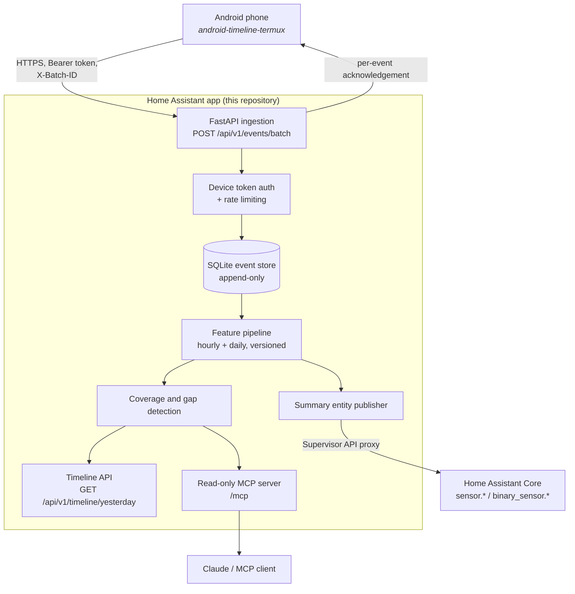

# android-timeline-home-assistant

[](https://github.com/resace3/android-timeline-home-assistant/actions/workflows/ci.yml)
[](https://github.com/resace3/android-timeline-home-assistant/actions/workflows/integration.yml)
[](https://github.com/resace3/android-timeline-home-assistant/actions/workflows/cross-repo-e2e.yml)
[](https://github.com/resace3/android-timeline-home-assistant/actions/workflows/build-app.yml)
[](https://github.com/resace3/android-timeline-home-assistant/actions/workflows/security.yml)
[](LICENSE)

> **Status: experimental.** The server side is exercised end to end in CI
> against the real collector, but **no physical Android phone has ever fed
> it.** See [Current limitations](#current-limitations).

A Home Assistant **app** (formerly "add-on") that receives raw timestamped
events from the
[`android-timeline-termux`](https://github.com/resace3/android-timeline-termux)
collector, stores them immutably, derives versioned hourly and daily
features, measures how much of each day was actually observed, publishes a
handful of summary entities, and exposes a **read-only MCP server** so
Claude can ask questions about the data.

## What it does

- **Authenticated ingestion.** Device-specific bearer tokens, stored only as
  keyed hashes. Idempotent on `event_id`, so a replay is always a no-op.
- **Immutable raw events.** Features are derived and versioned; recomputing
  them never rewrites history.
- **Explicit missingness.** Every hour is a row, including the empty ones. A
  flat line and a dead collector are different things and are reported
  differently.
- **Read-only MCP.** No SQL, no shell, no filesystem, no mutation, no phone
  control. Bounded ranges, pagination, and redaction that cannot be turned
  off.
- **Minimal privileges.** Ingress only, no published port, no Supervisor
  role, no Home Assistant directory mounted.

## Architecture



## Installation

1. In Home Assistant: **Settings -> Apps -> App store -> ⋮ -> Repositories**
2. Add `https://github.com/resace3/android-timeline-home-assistant`
3. Install **Android Timeline** from the store, then **Start** it.
4. Open the app's web UI (ingress) to reach the diagnostic page.
5. Enroll your phone:

   ```bash
   curl -X POST http://<app>/api/v1/admin/devices \
     -H 'Content-Type: application/json' \
     -d '{"device_id": "device-my-pixel-001"}'
   ```

   The response contains the device token **once**. Copy it into the
   collector's `~/.config/android-timeline/token`. Only a keyed hash is
   stored here; there is no way to recover it later, only to rotate.

Full details, including running behind ingress and the optional custom
integration: [docs/installation.md](docs/installation.md).

## Configuration

| Option | Default | Notes |
| --- | --- | --- |
| `timezone` | `UTC` | Where a "day" starts. Events are always stored in UTC. |
| `features_enabled` | `true` | Turning it off stops the pipeline; nothing is deleted. |
| `publish_entities` | `true` | Summary entities only, never one per event. |
| `mcp_enabled` | `true` | Read-only MCP endpoint, ingress-protected. |
| `trust_ingress_admin` | `true` | Safe because no port is published. |
| `admin_token` | *(empty)* | Only needed outside ingress. |
| `retention_enabled` | `false` | Raw events are kept forever by default. |

## API

| Endpoint | Auth | Purpose |
| --- | --- | --- |
| `GET /api/v1/health` | none | liveness; no user data |
| `POST /api/v1/events/batch` | device token | ingestion |
| `GET /api/v1/devices/{id}/status` | device token (own device) | queue and sync state |
| `GET /api/v1/timeline/yesterday` | admin | the day timeline |
| `GET /api/v1/timeline/{date}` | admin | a specific local date |
| `GET /api/v1/features/hourly` | admin | stored hourly features |
| `GET /api/v1/coverage` | admin | coverage and gaps |
| `POST /api/v1/admin/devices` | admin | enroll, returns a token once |
| `POST /api/v1/admin/devices/{id}/rotate` | admin | rotate, revoking the old token |
| `DELETE /api/v1/admin/tokens/{id}` | admin | revoke |

## MCP

Twelve read-only tools: `list_devices`, `list_phone_sources`,
`get_phone_latest`, `query_phone_events`, `get_day_timeline`,
`get_hourly_features`, `get_daily_features`, `get_data_coverage`,
`find_data_gaps`, `get_collector_status`, `export_phone_window` and
`describe_server`.

Guaranteed absent: arbitrary SQL, shell execution, filesystem access,
mutation of any kind, and phone control. Date ranges are capped at 31 days,
pages at 1000 rows, and precise coordinates, message bodies and contact
names are stripped with no parameter to re-enable them.

Client configuration (placeholders only): [docs/mcp.md](docs/mcp.md).

## Testing

| Layer | Status | What it proves |
| --- | --- | --- |
| Unit | **required** | database, auth, ingestion, features, coverage, timeline |
| API + MCP | **required** | the HTTP surface and the MCP protocol, in-process |
| Contract | **required** | Pydantic models and published JSON Schemas agree |
| E2E (in-process) | **required** | synthetic day -> ingest -> features -> timeline -> MCP, across a restart |
| Container (Layer A) | **required** | the real image: build, boot, drive, restart |
| Mock Supervisor (Layer B) | **required** | the one Supervisor endpoint this app calls |
| App image build (Layer D) | **required** | current official HA builder actions, amd64 + aarch64 |
| **Cross-repository E2E** | **required** | the **real collector** uploading to the **real image** |
| Home Assistant Core (Layer C) | non-blocking | the custom integration loads in a real HA container |
| Supervised HA (Layer E) | **not attempted** | see below |

The cross-repository workflow installs the actual collector from
`android-timeline-termux` at a pinned revision, runs its own outbox and
uploader against a container built from this repository, then asserts on
storage, idempotency, features, coverage and MCP. Details:
[docs/testing.md](docs/testing.md).

## Current limitations

Stated plainly:

- **No physical phone has ever fed this.** Every event CI has ever ingested
  is synthetic.
- **Supervisor is not tested in CI.** A real Supervisor needs privileged
  Docker-in-Docker or a full OS image; a flaky green result would be worse
  than an honest gap. Layer B tests the one endpoint this app actually
  calls, and nothing more.
- **Ingress trust is a design assumption.** Treating an ingress request as
  an authenticated admin is only safe because no port is published. If you
  publish one, set `admin_token` and turn `trust_ingress_admin` off.
- **SQLite, single writer.** Fine for a personal deployment; not a fleet.
- **Features are approximations.** `charging_minutes` and
  `wifi_connected_minutes` are inferred from periodic samples, so a state
  change between samples is invisible. Every value ships with a coverage
  proportion for exactly this reason.
- **The timeline has no polished UI.** The `/` page is a diagnostic table.

## Privacy considerations

- Raw events are stored as the phone sent them; the phone is where
  redaction happens, and it defaults to metadata only.
- The MCP server redacts precise coordinates, message bodies and contact
  names again on the way out, with no override.
- Home Assistant entities carry aggregates only, so the recorder database
  never accumulates behavioural detail.
- No fixture, test or CI artifact contains real personal data, and CI fails
  if a credential-shaped string appears anywhere in history.

## Relationship to the other repository

| | |
| --- | --- |
| [`android-timeline-termux`](https://github.com/resace3/android-timeline-termux) | runs on the phone: collection, the outbox, the upload client |
| **This repository** | runs in Home Assistant: ingestion, storage, features, coverage, MCP |

This repository is the **source of truth** for the protocol schemas in
`schemas/`. The collector vendors a byte-identical copy; the
cross-repository workflow diffs them directly and fails on any difference.
Both speak `protocol_version` 1. Compatibility policy:
[docs/data-model.md](docs/data-model.md).

## Development

```bash
python -m pip install -e ".[dev]"
ruff format . && ruff check . && mypy
pytest
```

Run the whole pipeline locally without Home Assistant:

```bash
docker compose -f test-harness/docker-compose.yml up --build
```

## Roadmap

- [ ] Ingest from a real phone (blocking for 1.0)
- [ ] QR-code device enrollment
- [ ] A real timeline UI
- [ ] Optional Postgres backend for larger deployments
- [ ] Intervention annotations feeding the causal-inference use case
- [ ] Feature definitions v2 with dwell-time and place transitions

## License

[MIT](LICENSE)
